# Pokédex Application

## 📑 Table of Contents

1. [🚀 Getting Started](#-getting-started)
2. [🏗️ Architecture Overview](#️-architecture-overview)
3. [🔧 Backend (Laravel API)](#-backend-laravel-api)
   - [📡 API Endpoints](#-api-endpoints)
   - [🚀 PokéAPI Integration & Batching](#-pokéapi-integration--batching)
   - [🎯 Key Backend Features](#-key-backend-features)
4. [🎨 Frontend (React SPA)](#-frontend-react-spa)
   - [🏛️ Client-Side Rendering (CSR) Architecture](#️-client-side-rendering-csr-architecture)
   - [📚 Tech Stack](#-tech-stack)
   - [🏗️ Frontend Architecture](#️-frontend-architecture)
   - [🔄 Data Flow Architecture](#-data-flow-architecture)
   - [🎯 Key Frontend Features](#-key-frontend-features)
   - [🎨 UI/UX Features](#-uiux-features)
5. [🔄 End-to-End Data Flow](#-end-to-end-data-flow)
6. [🚀 Performance Optimizations](#-performance-optimizations)
7. [🧪 Testing Strategy](#-testing-strategy)
8. [🎯 Key Technical Decisions](#-key-technical-decisions)

---

## 🚀 Getting Started

### Prerequisites
- Docker and Docker Compose
- Node.js and pnpm (for frontend development)

### Local Development Setup

1. **Clone the repository**
   ```bash
   git clone <repository-url>
   cd ballastlane-react-challenge
   ```

2. **Start the backend with Laravel Sail**
   ```bash
   cd backend
   ./vendor/bin/sail up -d
   ```

3. **Set up the database**
   ```bash
   # Run migrations to create database tables
   ./vendor/bin/sail artisan migrate
   
   # Seed the database with admin user
   ./vendor/bin/sail artisan db:seed
   ```

4. **Build and serve the frontend**
   ```bash
   cd frontend
   pnpm install
   pnpm build
   ```

5. **Access the application**
   - Open your browser and navigate to `http://localhost`
   - Login with credentials: `admin` / `admin`

### Development Commands
- **Backend**: `./vendor/bin/sail up -d` (starts Laravel with Docker)
- **Frontend Dev**: `pnpm run dev` (for development with hot reload)
- **Frontend Build**: `pnpm run build` (builds production assets)
- **Tests**: `./vendor/bin/sail phpunit` (backend) and `pnpm run test:e2e` (frontend)

---

## 🏗️ Architecture Overview

```mermaid
graph TB
    subgraph "Frontend (React SPA)"
        UI[React Components]
        Router[React Router]
        Query[TanStack Query]
        State[Context API]
    end
    
    subgraph "Backend (Laravel API)"
        Routes[API Routes]
        Controllers[Controllers]
        Services[Services Layer]
        Cache[Cache Layer]
    end
    
    subgraph "External APIs"
        PokeAPI[PokéAPI]
    end
    
    subgraph "Data Storage"
        DB[(Database)]
        CacheStore[(Cache Store)]
    end
    
    UI --> Router
    Router --> Query
    Query --> Routes
    Routes --> Controllers
    Controllers --> Services
    Services --> Cache
    Cache --> CacheStore
    Services --> PokeAPI
    Services --> DB
    
    classDef frontend fill:#e1f5fe
    classDef backend fill:#f3e5f5
    classDef external fill:#fff3e0
    classDef storage fill:#e8f5e8
    
    class UI,Router,Query,State frontend
    class Routes,Controllers,Services,Cache backend
    class PokeAPI external
    class DB,CacheStore storage
```



---

## 🔧 Backend (Laravel API)

### 📡 API Endpoints

#### Authentication Endpoints
```http
POST /api/login          # User authentication
POST /api/logout         # User logout
GET  /api/me            # Get authenticated user
```

#### Pokémon Endpoints
```http
GET  /api/pokemon                        # Search/list Pokémon (paginated)
GET  /api/pokemon/{identifier}           # Get basic Pokémon data
GET  /api/pokemon/{identifier}/overview  # Get overview tab data
GET  /api/pokemon/{identifier}/abilities # Get abilities tab data
GET  /api/pokemon/{identifier}/moves     # Get moves tab data
GET  /api/pokemon/{identifier}/forms     # Get forms tab data
```

### 🚀 PokéAPI Integration & Batching

The backend implements sophisticated batching and concurrent request handling:

```mermaid
sequenceDiagram
    participant Client
    participant Laravel
    participant Cache
    participant PokeAPI
    
    Client->>Laravel: GET /api/pokemon?name=pika&page=1
    Laravel->>Cache: Check pokemon_index cache
    
    alt Cache Miss
        Laravel->>PokeAPI: Fetch all Pokémon (limit=20000)
        PokeAPI-->>Laravel: Pokémon list
        Laravel->>Cache: Store for 24h
        Laravel->>Laravel: Batch insert to DB
    end
    
    Laravel->>Laravel: Query DB with search/pagination
    
    par Concurrent API Calls
        Laravel->>PokeAPI: Fetch pokemon/pikachu
        Laravel->>PokeAPI: Fetch pokemon/pikachup
        Laravel->>PokeAPI: Fetch pokemon/pichu
    and Nested Data Fetching
        Laravel->>PokeAPI: Fetch species URLs
        Laravel->>PokeAPI: Fetch ability URLs
    end
    
    PokeAPI-->>Laravel: Batch responses
    Laravel->>Cache: Store each response (24h TTL)
    Laravel-->>Client: Transformed data
```



### 🎯 Key Backend Features

#### 1. **Concurrent HTTP Requests**
```php
// Using Laravel's HTTP pool for parallel requests
$responses = Http::pool(fn ($pool) => 
    collect($urls)->mapWithKeys(fn ($url, $key) => [
        $key => $pool->as($key)
                     ->timeout(10)
                     ->retry(2, 100, throw: false)
                     ->get($url)
    ])->toArray()
);
```

#### 2. **Smart Caching Strategy**
- **L1 Cache**: Database cache (Redis)
- **Cache Keys**: URL-based for precise invalidation
- **TTL**: 24 hours for API data
- **Fallback**: Stale cache on API failures

#### 3. **Service Layer Architecture**


#### 4. **Request Flow Architecture**

```mermaid
flowchart TD
    Request[API Request] --> Middleware{Auth Check}
    Middleware -->|❌ Unauthorized| Reject[401 Response]
    Middleware -->|✅ Authorized| Controller[Pokemon Controller]
    
    Controller --> Service[PokeApiService]
    Service --> CacheCheck{Cache Check}
    
    CacheCheck -->|Hit| Return[Return Cached Data]
    CacheCheck -->|Miss| BatchFetch[Batch Fetch from API]
    
    BatchFetch --> Transform[Transform Data]
    Transform --> CacheStore[Store in Cache]
    CacheStore --> Return
    
    Return --> Response[JSON Response]
```


---

## 🎨 Frontend (React SPA)

### 🏛️ Client-Side Rendering (CSR) Architecture

**Why CSR was chosen:**
- **Interactivity**: Rich user interactions (search, modals, infinite scroll)
- **Performance**: Client-side caching and state management
- **User Experience**: Smooth transitions and responsive UI
- **API Integration**: Perfect for consuming REST APIs

### 📚 Tech Stack


### 🏗️ Frontend Architecture


### 🔄 Data Flow Architecture

```mermaid
sequenceDiagram
    participant User
    participant Component
    participant Hook
    participant TanStack
    participant API
    participant Backend
    
    User->>Component: Search "pikachu"
    Component->>Hook: usePokemonSearch({ name: "pikachu" })
    Hook->>TanStack: useInfiniteQuery
    
    alt Cache Hit
        TanStack-->>Hook: Return cached data
    else Cache Miss
        TanStack->>API: fetch("/api/pokemon?name=pikachu")
        API->>Backend: HTTP Request
        Backend-->>API: JSON Response
        API-->>TanStack: Parsed data
        TanStack->>TanStack: Store in cache
    end
    
    TanStack-->>Hook: Query result
    Hook-->>Component: { data, isLoading, error }
    Component-->>User: Render Pokémon cards
```



### 🎯 Key Frontend Features

#### 1. **Virtualization for Performance**
```typescript
// Using React Virtuoso for handling 20,000+ items
<VirtualizedPokemonGrid
  pokemon={allPokemon}
  onPokemonClick={handlePokemonClick}
  hasNextPage={hasNextPage}
  isFetchingNextPage={isFetchingNextPage}
  onLoadMore={fetchNextPage}
/>
```

#### 2. **Smart Caching Strategy**
```typescript
const queryClient = new QueryClient({
  defaultOptions: {
    queries: {
      retry: 2,
      staleTime: 5 * 60 * 1000,  // 5 minutes
      gcTime: 10 * 60 * 1000,    // 10 minutes
    },
  },
});
```

#### 3. **Responsive Design System**


#### 4. **Component Architecture**


### 🎨 UI/UX Features

- **Holographic Card Design**: Engaging visual effects
- **Infinite Scroll**: Seamless data loading
- **Skeleton Loading**: Better perceived performance
- **Responsive Modals**: Adaptive to screen size
- **Search with Debouncing**: Optimized API calls
- **Error Boundaries**: Graceful error handling

---

## 🔄 End-to-End Data Flow

```mermaid
flowchart TD
    User[👤 User] --> Search[🔍 Search Input]
    Search --> Debounce[⏱️ Debounced Query]
    Debounce --> TanStack[📦 TanStack Query]
    
    TanStack --> CacheCheck{💾 Cache Check}
    CacheCheck -->|Hit| Render[🎨 Render Results]
    CacheCheck -->|Miss| API[🌐 API Call]
    
    API --> Laravel[🏛️ Laravel Backend]
    Laravel --> AuthCheck{🔐 Auth Check}
    AuthCheck -->|❌| Unauthorized[🚫 401 Response]
    AuthCheck -->|✅| Service[⚙️ PokeApiService]
    
    Service --> DBCache{💾 DB Cache Check}
    DBCache -->|Hit| Transform[🔄 Transform Data]
    DBCache -->|Miss| BatchAPI[📡 Batch PokéAPI Calls]
    
    BatchAPI --> PokeAPI[🎮 PokéAPI]
    PokeAPI --> Cache[💾 Store in Cache]
    Cache --> Transform
    
    Transform --> Response[📤 JSON Response]
    Response --> TanStack
    TanStack --> UpdateCache[💾 Update Query Cache]
    UpdateCache --> Render
    
    Render --> Virtualization[📱 Virtualized Display]
    Virtualization --> User
```



---

## 🚀 Performance Optimizations

### Backend Optimizations
- **Concurrent API Calls**: Parallel HTTP requests using Laravel's pool
- **Multi-level Caching**: Database + in-memory caching
- **Database Optimization**: Efficient queries with proper indexing
- **Batch Operations**: Bulk insert for Pokémon index

### Frontend Optimizations
- **Virtualization**: Handle 20k+ items without performance degradation
- **Code Splitting**: Lazy load components with React.lazy
- **Query Caching**: Intelligent cache management with TanStack Query
- **Debounced Search**: Reduce unnecessary API calls

---

## 🧪 Testing Strategy

### Backend Testing
- **Unit Tests**: Service layer and business logic
- **Feature Tests**: API endpoint integration
- **Middleware Tests**: Authentication and validation

### Frontend Testing
- **E2E Tests**: User journey testing with Playwright
- **Component Testing**: Individual component behavior
- **Integration Testing**: Feature-level testing

---

## 🎯 Key Technical Decisions

### Why Laravel for Backend?
- **Rapid Development**: Built-in features
- **Robust Ecosystem**: Mature packages and community
- **Performance**: Efficient for API development with proper caching

### Why React for Frontend?
- **Component Architecture**: Reusable and maintainable
- **Rich Ecosystem**: Extensive library support
- **Performance**: Virtual DOM and optimization capabilities

### Why TanStack Query?
- **Smart Caching**: Automatic background updates
- **Optimistic Updates**: Better user experience
- **Built-in Loading States**: Simplified state management
